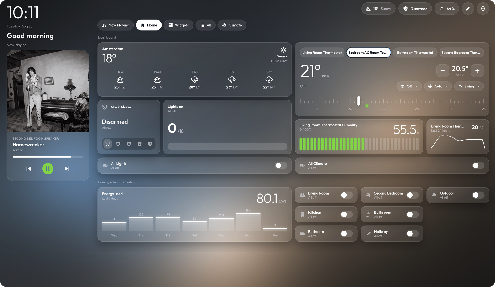
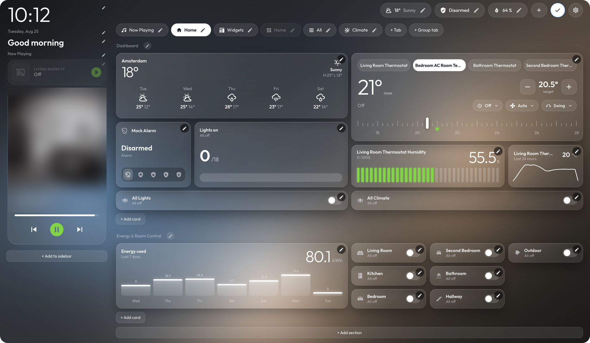
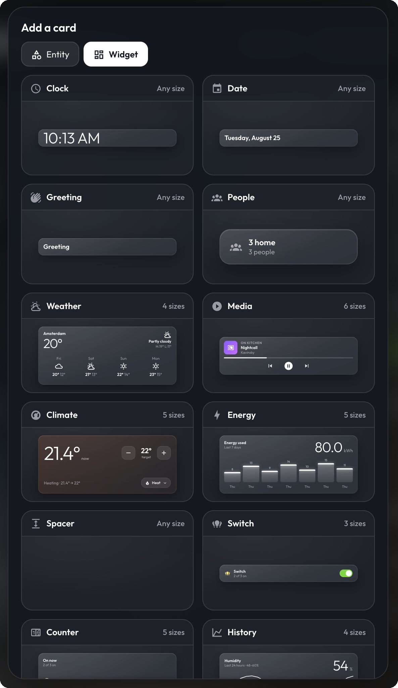
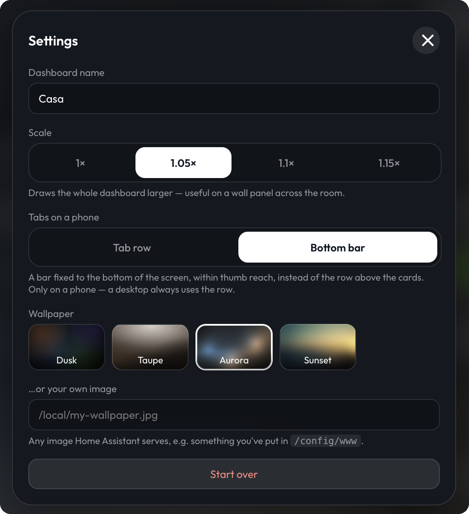

# Casa Dashboard

A glass-styled dashboard for Home Assistant that you build by dragging, not by writing YAML.

Install the integration, open **Casa** in the sidebar, press the pencil, and lay out your home.
Nothing is assumed about your setup — you start with an empty dashboard and add what you have.



## Features

- **In-place visual editor.** Press the pencil and the dashboard you are looking at becomes
  editable. Drag cards to reorder, drag a corner to resize, tap a card to open its inspector.
- **Five card shapes**, each matching a design rather than a generic template: *Small* (one line),
  *Compact* (two lines), *Expanded* (square), *Full* — a media hero, which only accepts
  `media_player` entities — and *Custom*, where you set the size yourself.
- **Seventeen widgets.** Cards that are not about one entity: clock, date, greeting, people,
  weather, media, climate, energy, switch, counter, history, gauge, quick actions, to‑do,
  calendar, needs attention, and a spacer.
- **Tabs and sections.** Group cards however you like, or add a **group tab**: pick entities and
  they are sorted into rooms for you, with filter chips for Lights, Climate, Media, Shades, Locks,
  Fans, Scenes, Switches and Sensors.
- **Per-screen visibility.** Every pill, tab, section and card can be shown on mobile, on desktop,
  or both — at least one must stay on.
- **Conditional cards.** Hide a card or a whole tab unless an entity is in a given state, so the
  media tab only appears when something is playing.
- **Header pills and a sidebar** for the clock, the date, a greeting, weather, people and sensors.
- **Your own wallpaper**, or the built-in gradient.

Your layout is stored in Home Assistant's own `.storage`. Nothing leaves your instance and the
integration makes no outbound connections.

## Requirements

Home Assistant **2024.11** or newer.

## Installation

### HACS

1. HACS → ⋮ → **Custom repositories** → add this repository, category **Integration**.
2. Install **Casa Dashboard**, then restart Home Assistant.
3. **Settings → Devices & Services → Add Integration → Casa Dashboard**.

### Manual

1. Copy `custom_components/casa_dashboard` into your Home Assistant `custom_components` folder.
2. Restart Home Assistant.
3. **Settings → Devices & Services → Add Integration → Casa Dashboard**.

**Casa** appears in the sidebar. There is nothing to add to `configuration.yaml` and nothing to
copy into `www/`.

## Opening Casa by default

Home Assistant's default-dashboard setting only offers *dashboards*, and Casa is a *panel* — a
sidebar entry — so it will not appear in that list. To land on Casa when you open Home Assistant
or the companion app, wrap it in a dashboard of its own. It takes a minute, once.

1. **Settings → Dashboards → + Add dashboard → New dashboard from scratch.** Call it `Casa`, and
   turn **Show in sidebar** off — the integration already puts Casa there.
2. Open the new dashboard, then **✏️ → ⋮ → Raw configuration editor**.
3. Replace everything in it with:

   ```yaml
   views:
     - type: panel
       title: Casa
       cards:
         - type: custom:casa-dashboard-panel
   ```

4. **Save**, then **Settings → Dashboards → ⋮** on that row → **Set as default**.

The default is stored per user, so everyone in the house sets their own — and each can choose
something different.

### Which one to point at

|  | Home Assistant's toolbar | Can be the default dashboard |
|---|---|---|
| **`/casa`** — the sidebar entry | none, the panel fills the screen | no |
| **the wrapper dashboard** | shown | yes |

On a wall display, point the browser straight at `/casa` and there is no toolbar to hide. The
wrapper only earns its place if you want Home Assistant to *open* on Casa.

### Hiding the toolbar and sidebar

Home Assistant has no setting for this, and Casa cannot do it from inside a card — the toolbar is
not ours to remove. If you already use [kiosk-mode](https://github.com/NemesisRE/kiosk-mode), it
can, either in the dashboard's raw configuration:

```yaml
kiosk_mode:
  hide_header: true
  hide_sidebar: true
views:
  - type: panel
    title: Casa
    cards:
      - type: custom:casa-dashboard-panel
```

…or per URL, which needs no configuration at all — useful for a Fully Kiosk start URL, a bookmark
or a homescreen shortcut:

```
/dashboard-casa?hide_header&hide_sidebar
```

`?kiosk` is shorthand for both. Separate several with `&`, and only the first takes the `?`. Adding
`&cache` makes the choice stick across dashboards on that device.

Note that the default-dashboard setting stores a path and not a URL, so it cannot carry a query
string — open the app that way and the toolbar returns. `kiosk_mode:` in the config is the one that
survives, and it also takes `admin_settings`, `non_admin_settings`, `user_settings` and
`mobile_settings` if you want the toolbar gone on the tablets but kept on your desktop.

## Building a dashboard

Press the **pencil** in the top right to enter edit mode. Every element gains an edit button, and
the ones that only exist while editing — the add buttons, the section pencils — fade in with it.
Press it again to leave.

Editing requires an administrator account. Everyone else sees the dashboard read-only.



### Tabs

**+ Tab** adds an ordinary tab that you fill yourself. **+ Group tab** adds one that fills itself:
choose entities and it sorts them into sections by room, with chips along the top to filter by kind.

Tap a tab's pencil for its name, icon, which screens it appears on, and its conditions. Drag a tab
sideways to reorder it.

A group tab still lets you set each room's width and order, and rename the heading — the pencil on
a section does that. What it will not let you do is place individual cards, because they are
regenerated from the entity list every time the tab is drawn.

### Sections

A tab is **six columns wide**. Each section takes some of them, so two three-column sections sit
side by side and a six-column section fills the row. The section pencil sets the name, the width,
and the order.

### Cards

**+ Add card** offers your entities. Pick one and it arrives in a shape suited to its domain; the
card's pencil then offers the five shapes, the entity, a name and icon override, which screens it
shows on, and its conditions.

Drag a card to move it. The others step out of the way and settle underneath, so a card always
lands where you dropped it rather than pushing everything down the page.

### Widgets

**+ Add card → Widgets** shows every widget drawn as itself, at the size it will arrive in, so you
are choosing from pictures rather than names.



| Widget | What it needs | Sizes (rows × columns) |
|---|---|---|
| Clock, Date, Greeting | — | free |
| People | — | 1×1 |
| Weather | a `weather` entity | 1×1, 2×1, 3×2, 3×3 |
| Media | a `media_player` | 2×1, 2×2, 3×1, 3×2, 3×3, Full |
| Climate | one or more `climate` | 2×1, 3×2, 3×3, 4×2, 4×3 |
| Energy | an energy sensor | 1×1, 2×1, 3×1, 3×2, 3×3 |
| Switch | any switchable entities | 1×1, 1×2, 1×3 |
| Counter | entities to count | 1×1, 2×1, 3×1, 3×2, 3×3 |
| History | a numeric sensor | 2×1, 3×1, 3×2, 3×3 |
| Gauge | a numeric sensor | 2×1, 2×2, 3×1, 3×2, 3×3 |
| Quick actions | scenes, scripts, buttons | 1×1 … 3×3 |
| To do | one or more `todo` lists | 2×1 … 3×3 |
| Calendar | one or more `calendar` | 2×1 … 3×3 |
| Needs attention | — | 1×1 … 3×3 |
| Spacer | — | free |

Sizes are listed **rows × columns**. A widget only offers the shapes its designs suit, so anything
else snaps to the nearest one rather than being drawn at a size it was never meant for. *Media* also
offers **Full**, which always spans the section and takes a row count of its own.

**Needs attention** is the one widget that reports on entities you did not choose: flat batteries,
doors left open, anything gone unavailable. It is the only card that can tell you about something
you never thought to add.

### Conditions

Every pill, tab, section and card takes a list of conditions, combined with **all** or **any**. A
rule watches an entity — or one of its attributes — and tests whether it is active, off, equal to
something, or above or below a number.

Put them on a *tab* and everything inside follows, which is how a Now Playing tab appears only when
something is playing.

### Sidebar and pills

The left column takes a clock, a date, a greeting, headings, sensor pills, a media card and gaps.
The pills across the top take weather, people and any sensor. Both are edited in place and reorder
by dragging.

### Settings

The **cog** holds the dashboard name, the wallpaper — four built in, or any image Home Assistant
serves — a **Scale** for reading a wall panel across the room, and **Tabs on a phone**, which
chooses between the pill row and a bottom navigation bar.



## Development

Deploy to a real Home Assistant:

```bash
HA_CONFIG=/path/to/your/homeassistant ./scripts/deploy.sh
```

Restart Home Assistant after the first copy. After that, only Python changes need a restart —
the frontend is served with `Cache-Control: no-cache`, so editing a `.js` file and reloading the
page is enough.

There is also a standalone harness in `dev/` that runs the dashboard against a fake home, with no
Home Assistant involved — useful for working on layout and for taking screenshots:

```bash
python3 -m http.server 8777
# then open http://localhost:8777/dev/
```

## Third-party code

`custom_components/casa_dashboard/frontend/lit-all.min.js` is [Lit](https://lit.dev),
© Google LLC, BSD-3-Clause. Its license header is preserved in the file.

## License

MIT — see [LICENSE](LICENSE).
